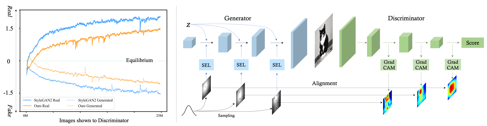

# EqGAN-SA: Improving GAN Equilibrium by Raising Spatial Awareness

> **Improving GAN Equilibrium by Raising Spatial Awareness** <br>
> Jianyuan Wang, Ceyuan Yang, Yinghao Xu, Yujun Shen, Hongdong Li, Bolei Zhou <br>
> *CVPR 2022*



[[Paper](https://arxiv.org/pdf/2112.00718.pdf)]
[[Project Page](https://genforce.github.io/eqgan-sa/)]
[[Demo](https://www.youtube.com/watch?v=k7sG4XY5rIc)]

In Generative Adversarial Networks (GANs), a generator (G) and a discriminator (D) are expected to reach a certain equilibrium where D cannot distinguish the generated images from the real ones. However, in practice it is difficult to achieve such an equilibrium in GAN training, instead, D almost always surpasses G. We attribute this phenomenon to the information asymmetry that D learns its own visual attention when determining whether an image is real or fake, but G has no explicit clue on which regions to focus on.

To alleviate the issue of D dominating the competition in GANs, we aim to raise the spatial awareness of G. We encode randomly sampled multi-level heatmaps into the intermediate layers of G as an inductive bias. We further propose to align the spatial awareness of G with the attention map induced from D. Through this way we effectively lessen the information gap between D and G. Extensive results show that our method pushes the two-player game in GANs closer to the equilibrium, leading to a better synthesis performance. As a byproduct, the introduced spatial awareness facilitates interactive editing over the output synthesis.  </div>

## TODO

:white_check_mark: Training Code

:white_check_mark: Training Script

:white_check_mark: Check the Code 

:white_check_mark: Pretrained Model

- [ ] User Interface


## Environment

This work was developed on the codebase [styleGAN2-ada-pytorch](https://github.com/NVlabs/stylegan2-ada-pytorch). Please follow its requirement as below:

* Linux and Windows are supported, but Linux is recommended for performance and compatibility reasons.
* The original codebase used CUDA toolkit 11.0 and PyTorch 1.7.1. Our experiments were conducted by CUDA toolkit 9.0 and PyTorch 1.8.1. Both the settings are acceptable but may observe a performance difference. Please also install torchvision along with pytorch.
* Python libraries: `pip install click requests tqdm pyspng ninja psutil scipy imageio-ffmpeg==0.4.3`. 

The code relies heavily on custom PyTorch extensions that are compiled on the fly using NVCC. On Windows, the compilation requires Microsoft Visual Studio. We recommend installing [Visual Studio Community Edition](https://visualstudio.microsoft.com/vs/) and adding it into `PATH` using `"C:\Program Files (x86)\Microsoft Visual Studio\<VERSION>\Community\VC\Auxiliary\Build\vcvars64.bat"`.


## Dataset Preparation

Please refer to the original page for [data processing](https://github.com/NVlabs/stylegan2-ada-pytorch#preparing-datasets) for details. 
All the datasets are stored as uncompressed ZIP archives containing uncompressed PNG files and a metadata file `dataset.json` for labels. Please see `dataset_tool.py` for more information. Alternatively, the folder can also be used directly as a dataset, without running it through `dataset_tool.py` first, but doing so may lead to suboptimal performance.

**FFHQ**:

Step 1: Download the [Flickr-Faces-HQ dataset](https://github.com/NVlabs/ffhq-dataset) as TFRecords.

Step 2: Extract images from TFRecords using `dataset_tool.py` from the [TensorFlow version of StyleGAN2-ADA](https://github.com/NVlabs/stylegan2-ada/):

```.bash
# Using dataset_tool.py from TensorFlow version at
# https://github.com/NVlabs/stylegan2-ada/
python ../stylegan2-ada/dataset_tool.py unpack \
    --tfrecord_dir=~/ffhq-dataset/tfrecords/ffhq --output_dir=/tmp/ffhq-unpacked
```

Step 3: Create ZIP archive using `dataset_tool.py` from this repository:

```.bash
# Scaled down 256x256 resolution.
python dataset_tool.py --source=/tmp/ffhq-unpacked --dest=~/datasets/ffhq256x256.zip \
    --width=256 --height=256
```


**LSUN**: Download the desired categories from the [LSUN project page](https://www.yf.io/p/lsun/) and convert to ZIP archive:

```.bash
python dataset_tool.py --source=~/downloads/lsun/raw/cat_lmdb --dest=~/datasets/lsuncat200k.zip \
    --transform=center-crop --width=256 --height=256 --max_images=200000
```

## Training

Taking the LSUN Cat dataset as an example: 

```.bash
python ./train.py --outdir=/runs --data=/data/lsuncat200k.zip --gpus=8 --cfg=paper256 \
--aug=noaug --pl_w=0 --close_style_mixing=True \
--use_sel=True --align_loss=True 
```

The flag `--use_sel` indicates using the spatial encoding layer or not, while `--align_loss` determines whether using the alignment loss.

You may replace `--data` by the paths of other datasets. We set `--aug` to `noaug` to disable the ADA augmentation, i.e., switching to StyleGAN2 instead of StyleGAN2-ADA. We close the path length regularization and style mixing because they have little effect on our method.


## Pretrained Models

The model for the LSUN Cat dataset has been available. 

We are retraining models for other two datasets to ensure reproduction, because the released code is slightly different from the version during submission. For example, the synthesis quality of the provided LSUN Cat model is a bit better than the result we reported in the paper, i.e., 6.62 vs 6.81.

| Model | FID | Link 
| :------: | :------: | :--------: 
| LSUN Cat    | 6.62     | [link](https://www.dropbox.com/s/ajuk1gqty0hcfk0/cat.pkl?dl=0) 
| LSUN Church    |   -  | Coming  
| FFHQ   |   -   | Coming  


## Acknowledgement

Thanks Janne Hellsten and Tero Karras for their excellent codebase [styleGAN2-ada-pytorch](https://github.com/NVlabs/stylegan2-ada-pytorch).


## BibTeX

```bibtex
@article{wang2021eqgan,
  title   = {Improving GAN Equilibrium by Raising Spatial Awareness},
  author  = {Wang, Jianyuan and Yang, Ceyuan and Xu, Yinghao and Shen, Yujun and Li, Hongdong and Zhou, Bolei},
  article = {arXiv preprint arXiv: 2112.00718},
  year    = {2021}
}
```
